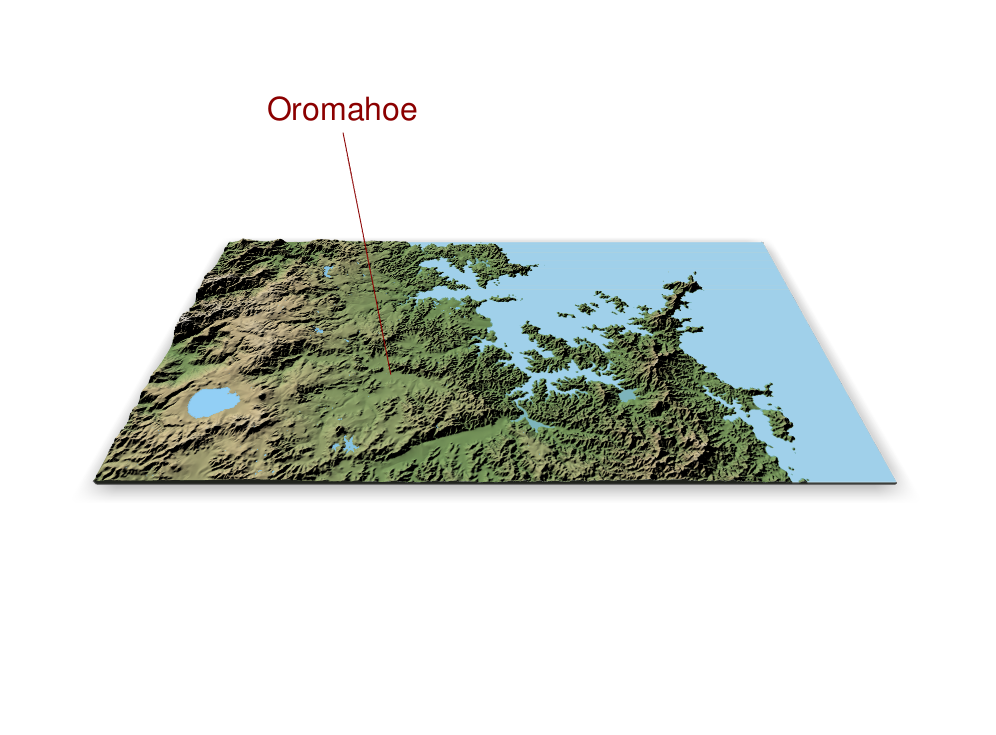
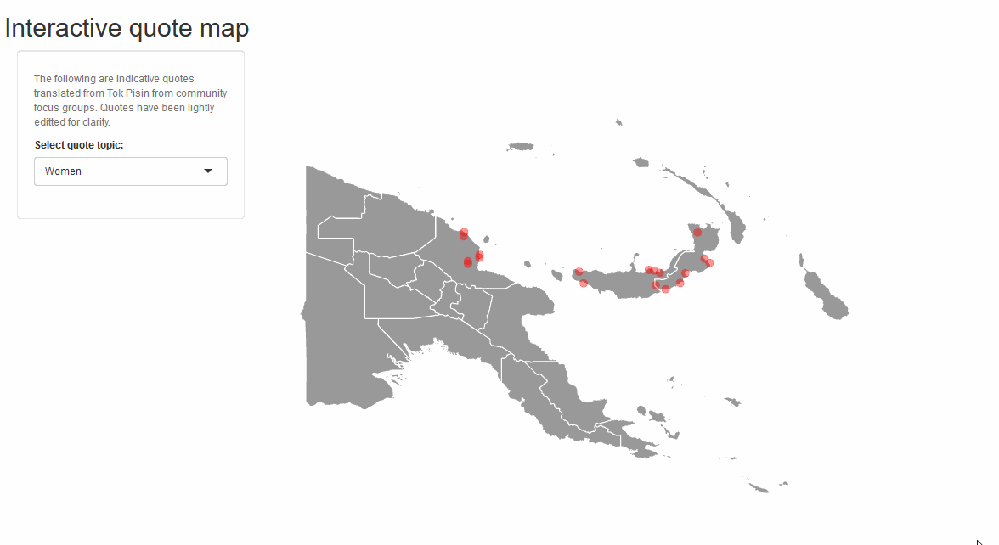

 <!-- Container for the image gallery -->

  <!-- Full-width images with number text -->
  

    
1 / 1

      
  

  

    
2 / 2

      
  

  

  <!-- Next and previous buttons -->
  <a class="prev" onclick="plusSlides(-1)">&#10094;</a>
  <a class="next" onclick="plusSlides(1)">&#10095;</a>

  <!-- Image text -->
  

    

  

  <!-- Thumbnail images -->
  

    

      
    

    

      
    

  

 

 
All of the following images, graphs, and dashboards were created in Program R
 

   
 

 

 
 
 

   
 

 

 
 
 

 

  

 
 
 

  
 

  
 

 
 
 

  
 

  
 

 
 
 

  
 

  
 
